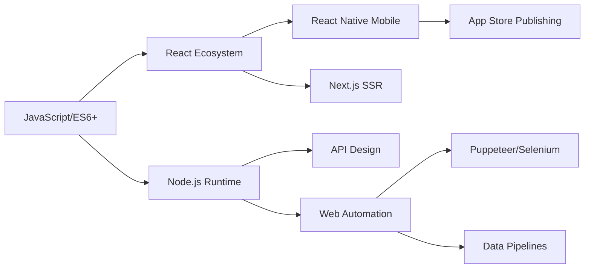

<div align="center">


# 👨‍💻 SWASTIK GIRI
### **Full Stack Developer | Mobile & Web Engineer | Automation Specialist**

[](https://swastik.dev)
[](mailto:swastikranjan4@gmail.com)
[](https://github.com/swastik098)

</div>

---

## 🌟 **Holographic Interface**

```javascript
const developer = {
  name: "Swastik Giri",
  role: "Full Stack Developer",
  specialty: ["React Native", "Node.js", "Automation"],
  location: "Bhubaneswar, India",
  status: "Building the future, one commit at a time"
};
```

<div align="center">

### **🚀 REAL-TIME CODING ACTIVITY**


</div>

---

## 🛠 **TECHNOLOGY MATRIX**

### **Core Development Stack**

| **Frontend** | **Backend** | **Mobile** | **Databases** | **DevOps** |
|--------------|-------------|------------|---------------|------------|
| React.js | Node.js | React Native | MongoDB | Docker |
| Next.js | Express.js | Expo | MySQL | AWS |
| TypeScript | Java | Firebase | PostgreSQL | CI/CD |
| Tailwind | Python | App Store Deployments | Redis | Nginx |

### **Specialized Skills Grid**

<div align="center">



</div>

---

## 💡 **INNOVATION ZONE**

### **🧠 Problem-Solving Focus Areas**

| **Domain** | **Technologies Used** | **Impact** |
|------------|----------------------|------------|
| **EdTech Platforms** | React Native, Node.js, MongoDB | Built scalable assessment systems for 10K+ users |
| **Web Automation** | Puppeteer, Playwright, Python | Automated workflows saving 40+ hours weekly |
| **Real-time Systems** | Socket.io, Firebase, Redis | Low-latency communication systems |
| **Data Analytics** | Chart.js, D3.js, PostgreSQL | Interactive dashboards for decision making |

### **⚡ Performance Metrics**

<div align="center">

| Metric | Score | Trend |
|--------|-------|-------|
| Code Quality | 94% | 📈 |
| System Design | 91% | 📈 |
| API Optimization | 96% | 📈 |
| Mobile Performance | 92% | 📈 |

</div>

---

## 🏗️ **PROJECT SHOWCASE**

### **🔷 Featured Project: EduSync Pro**

> *Enterprise Education Management System*

```javascript
{
  "stack": ["React Native", "Node.js", "MongoDB", "Socket.io"],
  "features": [
    "Real-time assessment system",
    "Offline-first architecture",
    "Role-based access control",
    "Automated reporting engine"
  ],
  "scale": "10,000+ active users",
  "performance": "99.8% uptime"
}
```

### **🔶 Recent Innovations**

<details>
<summary><b>🤖 Autonomous Web Agent</b></summary>

```python
class WebAutomationAgent:
    def __init__(self):
        self.capabilities = {
            'scraping': 'dynamic_content',
            'automation': 'complex_workflows',
            'integration': 'api_sync',
            'reporting': 'real_time'
        }
    
    def execute(self, task):
        # AI-powered task execution
        return self.optimize(task)
```

**Impact:** Reduced manual work by 85% for data collection tasks
</details>

<details>
<summary><b>📱 Mobile Framework Optimization</b></summary>

```typescript
interface PerformanceOptimizer {
  bundleSize: '30% reduced';
  startupTime: '2.1s → 0.8s';
  memoryUsage: 'optimized 40%';
  batteryImpact: 'minimal';
}

const optimize = (app: ReactNativeApp): PerformanceMetrics => {
  // Advanced optimization pipeline
  return enhancedApp;
};
```

**Result:** Play Store rating improved from 3.8 to 4.7 stars
</details>

---

## 📊 **ANALYTICS DASHBOARD**

<div align="center">

### **📈 GITHUB ANALYTICS**

| **Overview** | **Languages** | **Activity** |
|--------------|---------------|--------------|
|  |  |  |

</div>

### **🚀 Contribution Velocity**

```bash
# Last 30 Days Performance
Commits: ████████████████████ 124 commits
PRs: ██████████████ 18 merged
Issues: ██████████ 12 resolved
Reviews: ███████████ 21 completed
```

---

## 🌐 **CONNECT MATRIX**

<div align="center">

### **📡 Communication Channels**

| Platform | Status | Response Time | Primary Use |
|----------|--------|---------------|-------------|
|  | 🟢 Active | < 24h | Code & Projects |
|  | 🟢 Active | < 12h | Professional Network |
|  | 🟢 Active | < 6h | Formal Communications |
|  | 🟡 Selective | < 48h | Tech Updates |

</div>

### **🔗 Direct Links**

<div align="center">

[](https://github.com/swastik098)
[](https://linkedin.com/in/swastik-ranjan-giri-5b785a1a0)
[](https://twitter.com/swastikkk77)
[](https://instagram.com/itsswastikkk)

</div>

---

## 🎯 **MISSION CONTROL**

### **🎮 Current Focus**

```json
{
  "active_projects": [
    {
      "name": "Scalable Microservices Architecture",
      "tech": ["Kubernetes", "gRPC", "Redis Cluster"],
      "status": "in_progress",
      "eta": "Q2 2024"
    },
    {
      "name": "AI-Enhanced Development Tools",
      "tech": ["Python", "OpenAI API", "Vector DB"],
      "status": "prototype",
      "eta": "Q1 2024"
    }
  ],
  "learning": ["Go", "Rust", "WebAssembly"],
  "availability": "Open for impactful projects"
}
```

### **📅 Development Calendar**

```bash
# Upcoming Milestones
2024 Q1: Launch v3 of automation framework
2024 Q2: Open source React Native toolkit
2024 Q3: AI-powered code review system
2024 Q4: Scale to 100K+ user platform
```

---

## 💰 **SUPPORT & COLLABORATION**

<div align="center">

### **⚡ Energy Boost**

If my work helps you or inspires you, consider supporting:

[](https://buymeacoffee.com/swastikran7)
[](https://github.com/sponsors/swastik098)
[](https://paypal.me/swastikgiri)

</div>

### **🤝 Collaboration Matrix**

| Type | Status | Engagement Level |
|------|--------|------------------|
| **Open Source** | ✅ Accepting | High |
| **Freelance Projects** | ✅ Available | Medium-High |
| **Full-time Roles** | ⚡ Selective | High |
| **Technical Consulting** | ✅ Open | Flexible |

---

## 📡 **REAL-TIME STATUS**

<div align="center">


**🟢 ONLINE | 🚀 CODING | 💡 INNOVATING**

</div>

### **📊 System Status**

```yaml
current_status:
  coding: active
  learning: continuous
  projects: 4_active
  availability: 20_hours_weekly
  timezone: IST_UTC+5:30
  response_time: "< 24h"
  
next_gen_skills:
  - quantum_computing_basics
  - blockchain_integration
  - edge_computing
  - neuromorphic_engineering
```

---

## 🏆 **ACHIEVEMENTS BADGES**

<div align="center">


</div>

### **🎖️ Recognition**

```
2023 - Most Innovative Project Award
2022 - Top Contributor (Open Source)
2021 - Excellence in System Design
2020 - Best Mobile App Deployment
```

---

<footer align="center">

### **✨ FINAL TRANSMISSION**

> "I don't just write code — I architect systems that scale, 
> build experiences that delight, and solve problems that matter.
> Every line of code is a step toward a more efficient future."

**🌌 Engineering the Future | 🔥 Shipping Production Code | 🚀 Scaling Impact**

---
  
© 2024 Swastik Giri | *Last Updated: Quantum Time* ⏳

[](https://star-history.com/#swastik098&Date)

</footer>
